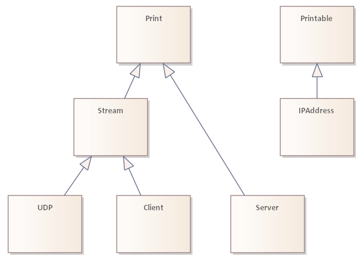

# Intro to Arduino networking API

## History

The Arduino Networking API was first introduced with the [Arduino Ethernet](https://github.com/arduino-libraries/Ethernet) library in 2008. As the Arduino language itself, the Ethernet library was inspired by [networking API in the Processing language](https://processing.org/reference/libraries/net/index.html). 

In 2011 Arduino introduced the [WiFi](https://github.com/arduino-libraries/WiFi) library with analogous API. 

In 2014 the [esp8266 Arduino core](https://github.com/esp8266/Arduino) was developed with WiFi library API using Client, Server, UDP class and other methods to be compatible with sketches written for the Arduino WiFi library. The esp32 core and WiFi library was later based on the esp8266 core. The Espressif's SDKs has LwIP under the hood.

The [WiFi101](https://github.com/arduino-libraries/WiFi101) library from 2015 and the [WiFiNINA](https://github.com/arduino-libraries/WiFiNINA) library from 2018 are based on the first WiFi library's source code. 

Version 2 of the Arduino Ethernet library in 2018 introduced new functions into the API: client.setConnetionTimeout, server.accept and server's bool operator. 

In 2018 Arduino introduced the Mbed core where the Ethernet and WiFi library wrap the Mbed networking support which uses LwIP.

In 2023 Arduino [Renesas Core](https://github.com/arduino/ArduinoCore-renesas) for Portenta C33 board has Arduino's first LwIP based Ethernet and WiFi libraries and all network interfaces are handled by one TCP/IP stack.

The [WiFiS3](https://github.com/arduino/ArduinoCore-renesas/blob/main/libraries/WiFiS3) library for the Uno R4 in 2023 introduced further updated API for Server with constructor without a parameter, server.begin with parameter port and server.end().

## TCP/IP

All Arduino networking libraries are for TCP/IP networks. The Client class is for a TCP connection, the Server class is for a TCP listening socket and the UDP class is for receiving and sending UDP messages. The  Ethernet/WiFi object handles the control of the network interface and hardware.

Some libraries incorporate the TCP/IP stack, some only communicate with a firmware in the networking module which includes the TCP/IP stack.

With more powerful MCUs the LwIP TCP/IP stack implementation is now used in many Arduino networking  libraries. The Arduino API then wraps the network interface(s) configuration and the raw or socket API of LwIP. Now multiple LwIP based Arduino networking libraries have support for multiple network interfaces and have Ethernet and WiFi API 'facades'.

## Not ideal

As every API, the Arduino networking API has some not ideal design choices. Some are inherited from Processing networking API. The API even has mistakes and mistakes in the first implementation we have to live with. (For examples int return values which are used as bool.)

Every API change after the initial design is limited by compatibility. Breaking changes must be avoided. So changes have to prioritize compatibility over the ideal design.

Even the API is not ideal, it is established, so it makes sense to use it for the portability of sketches and libraries which use networking.

# Creating an Arduino networking library

## Names

An Ethernet library should have EthernetClent.h with EthernetClient class, EthernetServer.h with  EthernetServer class and EthernetUdp.h with EthernetUDP class with this exact names including the case. It is good to have Ethernet.h which includes these header files.

A WiFi library should have WiFiClient.h with a WiFiClient class, WiFiServer.h with a WiFiServer class and WiFiUdp.h with a WiFiUDP class with this exact names including the case. It is good to have WiFi.h which includes these header files.

Note that the header file for UDP uses "Udp" and the class name uses "UDP".

To specify the library in the sketch with an include directive, the library must have a header file with a unique name. This name should be specified in library.properties file `includes` key. The build system ensures that any other include from the library in the sketch source files or in other libraries included in the sketch will be from this library. For example `#include <WiFiUdp.h>` will use WiFiUdp.h from the WiFi library included in the sketch.

Libraries bundled with a core can have generic names WiFi and Ethernet, because bundled libraries have priority over installed libraries.

It is not expected that a sketch would use two Ethernet libraries or two WiFi libraries. But it can use a WiFi library and an Ethernet library together.

## Core classes

A networking library will implement base classes from core: Client, Server and UDP class. These classes inherit from Print for print functions and Stream for read functions.



Historically the Arduino core was copied from the AVR core. Now the [Core API](https://github.com/arduino/ArduinoCore-API) has a separate repository on GitHub and many boards packages link it. Still many boards packages have old copy of core API classes, with some updates from the official Core.

The IPAddress class from core should be used in a networking library. From version 1.4.0 Core API  IPAddress has IPv6 support.

## Architecture of the library

For a library implemented over a firmware in the networking module, the library will have a low level part which communicates with firmware and the API level classes which implements the Arduino networking API. Usually the low level part is in the utility folder. 

Useful is to have buffers to allow to read more bytes of data at once even if user reads them byte by byte.

Write buffer can optimize transfers to the networking module and sometimes even transfer over the network. Write buffer requires implementation of flush() and users have to use flush() or the library can invoke flush if user checks availability of data to read and the write buffer is not flushed yet. An example of bad implementation of sending data is the Ethernet library. If data are sent with individual byte writes, packets with one bye are sent over the network. The Print functions for progmem write individual bytes.

For a networking library with LwIP the library will have Arduino networking API classes wrapping LwIP API and one or more network interface implementations for the specific networking hardware. Ideal would be to have only one Arduino library with LwIP and implement only libraries with the drivers for specific hardware.

# Network interface control

An Arduino networking library has a global object named Ethernet or WiFi. The implementing class is usually named EthernetClass/ WiFiClass. Users invoke methods on the global object. 

The global object combines sets of functions for:
* the hardware (pins, serial comm, state, fw version, power save)
* the physical layer (join WiFi network, start AP, link status)
* the network interface(s) (MAC, IP address, mask, gateway IP)
* network services (DHCP, DNS, NTP, ping)

## Hardware control

### init / setPins (optional)

Some libraries require to configure the communication with the networking hardware. Examples are CS pin, SPI instance, Serial instance, pins for SPI.

Examples:

* Ethernet library has `static void init(uint8_t sspin = 10);`
* WiFi101 library has `void setPins(int8_t cs, int8_t irq, int8_t rst, int8_t en = -1);`
* WiFiEspAT has `bool init(Stream& serial, int8_t resetPin = -1);`

### hardwareStatus() (optional)

In Ethernet libraries method [`hardwareStatus()`](https://www.arduino.cc/reference/en/libraries/ethernet/ethernet.hardwarestatus/) returns enumerated value with the identification of the chip or the `EthernetNoHardware` value. Examples use it as a way to test the communication with the hardware.

In WiFi libraries method [`status()`](https://www.arduino.cc/reference/en/libraries/wifi/wifi.status/) is used to return the status of the WiFi (station), but it can return values WL_NO_SHIELD or WL_NO_MODULE so examples use it to test the communication with the hardware.

This methods must work before `begin` is called. If `init` or `setPins` is required, the user must invoke it before `hardwareStatus`/`status`. 

### firmwareVersion (optional)

Libraries for networking hardware with update-able firmware use [`firmwareVersion`](https://www.arduino.cc/reference/en/libraries/wifinina/wifi.firmwareversion/) in examples to warn users about outdated firmware.

Libraries use short private char array string in 'WiFiClass' to store the retrieved version number and the function returns a pointer to this array. If the array is static in the class, the compiler can optimize it away if it is not used. 

The method can have an optional parameter for user provided char array (on stack) and the compiler can then optimize away the static char array.

This method must work before `begin` is called. If `init` or `setPin` is required, the user must invoke it before `firmwareVersion`.

### end() (optional)

For WiFi [`end()`](https://www.arduino.cc/reference/en/libraries/wifinina/wifi.end/) disconnects station from AP, stops local AP, turns off the WiFi module.

### macAddress (optional)

```
  uint8_t* macAddress(uint8_t* mac);
```

Fills the MAC address into the array `mac` and returns the pointer to that array.

Some Ethernet libraries have it as `MACAddress`.

## Join the network

### begin

Methods named `begin` are used to connect to network with DHCP or static IP settings.

Some Ethernet hardware requires to set the MAC address. Then all versions of [`begin`](https://www.arduino.cc/reference/en/libraries/ethernet/ethernet.begin/) have it as a first parameter.

For WiFi libraries [`begin`](https://www.arduino.cc/reference/en/libraries/wifi/wifi.begin/) has parameters for SSID and password/key and optional BSSID. It joins the specified AP.

Static IP settings for Ethernet are usually additional parameters for `begin`. Static IP settings for WiFi libraries use method `config` to set the IP addresses.

If static IP is not provided, `begin` connects to network using DHCP to get the network settings. 

Method `begin` for DHCP is blocking. It returns 1 when DHCP settings were received and 0 if DHCP failed. For Ethernet libraries `begin` for DHCP can have additional optional parameters for timeouts for DHCP communication.  WiFiNINA, for example, has `setTimeout` to set the timeout for `begin`.

In esp8266 and esp32 WiFi libraries `begin` is not blocking. User must check `status()` or use method `waitForConnectResult`.

In some WiFi libraries method `begin` without parameters attempts to join the last used AP.

### beginEnterprise

TODO

### disconnect() (WiFi)

Method [`disconnect`](https://www.arduino.cc/reference/en/libraries/wifi/wifi.disconnect/) in WiFi libraries leaves the WiFi network.

### setHostname (DHCP)

Method [`setHostname`](https://www.arduino.cc/reference/en/libraries/wifinina/wifi.sethostname/) provides a way to set the hostname sent with the DHCP request. In some WiFi libraries this name is used for the locally started AP too.

### maintain() (optional)

Some libraries require periodic maintenance to handle the network even if no other methods of library objects are invoked. User is then required to call the method [`maintain`](https://www.arduino.cc/reference/en/libraries/ethernet/ethernet.maintain/) periodically.

## Static IP

### begin (Ethernet) and config (WiFi)

Most Ethernet libraries have static IP configured as parameters of method [`begin`](https://www.arduino.cc/reference/en/libraries/ethernet/ethernet.begin/). WiFi libraries have method [`config`](https://www.arduino.cc/reference/en/libraries/wifi/wifi.config/).If the library uses `config`, for static IP, `config` must be executed before `begin` to skip DHCP.

```
config(IPAddress local_ip, IPAddress dns_server = IP_ALL_ZERO, IPAddress gateway = IP_ALL_ZERO, IPAddress subnet = IP_ALL_ZERO);
```

For static IP configuration user must specify the local IP address. The rest of the settings is optional and the library will use default values: DNS and gateway as .1 IP address in the same network and net mask 255.255.255.0. 

For unifying the API, Ethernet libraries should use `config` too.

### setDNS (optional)

Method [`setDNS`](https://www.arduino.cc/reference/en/libraries/wifinina/wifi.setdns/) allows to specify up to two DNS server IP addresses.

```
setDNS(IPAddress dns_server1, IPAddress dns_server2 = IP_ALL_ZERO);
```

Ethernet libraries historically have method `setDnsServerIP` with one parameter.

## Query network configuration

### localIP, gatewayIP, subnetMask

These methods return the corresponding IP addresses sent by DHCP or set as static IP configuration.

### dnsIP

```
IPAddress dnsIP(uint8_t n = 0);
```

The method returns the currently configured IP address for the DNS. The method has an optional parameter to specify the index in case of support for multiple DNS servers. Even libraries which support only one DNS server should have the parameter to support generic use.

The method was first used in a library by Arduino (WiFiS3) only recently and is not yet documented by Arduino. It was introduced long time ago in the ESP8266WiFi library. 

Ethernet libraries historically have method `dnsServerIP` without a parameter.

### SSID and BSSID (WiFi)

Methods `SSID` and [`BSSID`](https://www.arduino.cc/reference/en/libraries/wifinina/wifi.bssid/) return the settings for the current AP the station is joined to. Method BSSID is optional and returns the MAC address of the device to which the Arduino connected.

SSID is without a parameter and should return a C string stored in the library. BSSID has a parameter for array into which the function should store the MAC address of the AP.

## Network status

### linkStatus (Ethernet, optional)

Method [`linkStatus`](https://www.arduino.cc/reference/en/libraries/ethernet/ethernet.linkstatus/) returns one of `EthernetLinkStatus` enumeration values:
```
enum EthernetLinkStatus {
	Unknown,
	LinkON,
	LinkOFF
};
```

It should work before `begin` is called.  If `init` or `setPin` is required, the user must invoke it before `linkStatus`.

### status (WiFi)

Method [`status()`](https://www.arduino.cc/reference/en/libraries/wifi/wifi.status/) returns the state of the WiFi station as one of `wl_status_t` enumeration values. 

A special value `WL_NO_SHIELD` / `WL_NO_MODULE` is used to indicate problem communicating with the networking hardware, therefor it must work before `begin` is called.

Libraries where STA and AP can't work at the same time, use `status` to indicate AP mode status too.

Common values in the wl_status_t enum:
```
typedef enum {
    	WL_NO_SHIELD = 255,
        WL_NO_MODULE = WL_NO_SHIELD,
        WL_IDLE_STATUS = 0,
        WL_NO_SSID_AVAIL,
        WL_SCAN_COMPLETED,
        WL_CONNECTED,
        WL_CONNECT_FAILED,
        WL_CONNECTION_LOST,
        WL_WRONG_PASSWORD,
        WL_DISCONNECTED,
        WL_AP_LISTENING,
        WL_AP_CONNECTED,
        WL_AP_FAILED
} wl_status_t;
```
It should work before `begin` is called.  If `init` or `setPin` is required, the user must invoke it before `status`.

### reasonCode() (very optional)

WiFiNINA introduced method reasonCode but no other library has it implemented. It should return the reason why WiFi.begin failed. The return values are from firmware and are [ESP32 wifi_err_reason_t values](https://docs.espressif.com/projects/esp-idf/en/latest/esp32/api-guides/wifi.html#wi-fi-reason-code).

For the same purpose In esp8266 WiFi library the WL_WRONG_PASSWORD was added to status() return values.

### RSSI (WiFi)

Method [RSSI](https://www.arduino.cc/reference/en/libraries/wifinina/wifi.rssi/) without parameter returns the signal strength as reported by the RF module.

### encryptionType (WiFi)

Method [`encryptionType`](https://www.arduino.cc/reference/en/libraries/wifinina/wifi.encryptiontype) Returns the encryption type used on the WiFi. It is a value from enum wl_enc_type
```
enum wl_enc_type {  /* Values map to 802.11 encryption suites... */
        ENC_TYPE_WEP  = 5,
        ENC_TYPE_TKIP = 2,
        ENC_TYPE_CCMP = 4,
        /* ... except these two, 7 and 8 are reserved in 802.11-2007 */
        ENC_TYPE_NONE = 7,
        ENC_TYPE_AUTO = 8,

        ENC_TYPE_UNKNOWN = 255
};
```

### channel (WiFi, optional)

Returns the current RF channel used by the WiFi station network interface.

## Scan networks (WiFi)

TODO
```
  int8_t scanNetworks(); // using internal array will occupy a lot of SRAM
  int8_t scanNetworks(WiFiApData* _apData, uint8_t apDataSize); // optional version
  const char* SSID(uint8_t index);
  uint8_t encryptionType(uint8_t index);
  uint8_t* BSSID(uint8_t index, uint8_t* bssid);
  uint8_t channel(uint8_t index);
  int32_t RSSI(uint8_t index);
  
  setScanMethod, setSortMEthod
 ```
 
## WiFi Access Point mode 

Most WiFi libraries have AP mode, where the WiFi module creates the WiFi network for other devices to join. Some libraries can run station mode and AP mode at the same time (with some limitations), but most libraries can only run in one of the modes at time.

There should be some unification effort for these methods in Arduino networking API. It would allow generic libraries for WiFi provisioning with local AP (WiFiManager library and similar).

### beginAP

Method [`beginAP`](https://www.arduino.cc/reference/en/libraries/wifinina/wifi.beginap/) starts the Access Point mode. If the library can't run station and AP mode at the same time, `beginAP` ends the station mode.

### endAP (optional)

Most libraries don't have `endAP`.  If the library can't run station and AP mode at the same time, `begin` for station ends the AP mode.

### Configure AP (optional)

Some libraries have some methods to set the IP address range, network mask, gateway, DNS for the AP mode WiFi network.

### AP mode getters 

For libraries which can only run one WiFi network interface at time, after `beginAP` standard WiFi network interface getters read the AP information.

Examples:
* The esp8266 and esp32 libraries have softAPmacAddress, softAPSSID, softAPPSK, softAPIP.
* WiFiEspAT library has apMacAddress, apSSID, apPassphrase, apEncryptionType, apIP, apGatewayIP,	apSubnetMask.

## Services

The networking library's global object (Ethernet, WiFi) also provides access to some simple network services. 

### DHCP

The DHCP service is 'hidden' in the `begin` method.

### hostByName (optional)

Method [`hostByName`](https://www.arduino.cc/reference/en/libraries/wifinina/wifi.hostbyname/) wraps the DNS service. Even every method taking a remote host IP address has a variant for host's name, users may prefer to resolve the IP address first.

The hostByName implementation as first should attempt to parse the hostname as IP address.

### ping (optional)

Some libraries have a `ping` method with versions for IPAddress and host name as c-string or String.

### getTime (optional)

For secure connections the networking libraries/firmware need time and they get it from Internet. User can access this value with getTime. It is seconds from Jan 1 1970.

Some libraries allow to configure the NTP servers to use. There is no standard name for the configuration method.

# TCP Client

Arduino Core API defines a base class `Client` to handle TCP communication. The implementations in Arduino networking libraries should use names EthernetClient/WiFiClient.

## Implementation

The base `Client` class has only pure virtual methods. Some of them are a repeat or even undefine of virtual functions from Print and Stream.

Client objects are used for connections initiated on the local device and same type of Client objects are returned by server object for connections initiated by remote host.

The implementation of the Client class must have a constructor without parameters. Usually there is a second constructor for server to create a client object for an incoming connection.

Important! The implementation of the Client class must by copyable and all copies must stay valid to be used with the connection concurrently. The object can't hold the state of the underlying connection and buffers, there must by other object to which all copies of the Client object for the specific TCP connection refer.

Networking hardware firmwares and LwIP use a number to identify one of the limited number of available 'sockets'. An active Client uses a socket. The library has to manage use of sockets by Clients. For example when the socket disconnects the Client object still may have data to read from receive buffer. Does the library make the socket available for the next Client at that time or it waits until all the data are read and the sketch calls stop()? In stop(), will the library wait until the socket is closed to mark it free or it will exist stop() immediately and mark the socket as free based on an event or later check?

## Connection

### connect

The method [`connect`](https://www.arduino.cc/reference/en/libraries/ethernet/client.connect/) is pure virtual in Client class. There are two versions one with IPAddress and one with a c-string for host name. The second parameter is the remote port.

`connect` is blocking. Some libraries have a way to set timeout for `connect`.

`connect` returns 1 if the connection was established and 0 if the connection was not successful. No other return values are allowed.

### stop

The method [`stop`](https://www.arduino.cc/reference/en/libraries/ethernet/client.stop/) is pure virtual in Client class. It closes the TCP connection. It doesn't have to wait until the connection closing is negotiated with the peer, but the library must ensure that the underling resources are not reused for a new `connect` before the TCP connection is closed.

In stop() the receive buffer can be disposed. 

### operator bool

The [`operator bool`](https://www.arduino.cc/reference/en/libraries/ethernet/if-ethernetclient/) is pure virtual in Client class. It should return true if the object is assigned to underlying resource representing the TCP connection and false if the object is empty/dummy. It is used with server's `available` or `accept` which return an empty Client object if there is no connection to return.

### connected()

The method [`connected`](https://www.arduino.cc/reference/en/libraries/ethernet/client.connected/) is pure virtual in Client class. It should return true if the connection is established **or available() returns true**.

Some libraries don't check if there are data still available to read from the receive buffer. 

### setConnectionTimeout (optional)

Method [`setConnectionTimeout`](https://www.arduino.cc/reference/en/libraries/ethernet/client.setconnectiontimeout/) allows to set a timeout for the `connect` method. The value is in milliseconds.

The timeout can be used in `stop()` method too, if the library must wait for successful termination of the TCP connection to free the 'socket'. (It is the reason for the name of the function as 'setConectionTimeout' and not 'setConnectTimeout').

Note: avoid the mistake naming this method setTimeout. It would shadow Stream::setTimeout which has a different function.

### status() (optional)

Method `status` returns the state of the connection. Minimal useful set is CLOSED and ESTABLISHED. The library must have constants for the set of values it can return. The names of the constants are:
```
  CLOSED
  LISTEN 
  SYN_SENT
  SYN_RCVD
  ESTABLISHED
  FIN_WAIT_1
  FIN_WAIT_2
  CLOSE_WAIT
  CLOSING
  LAST_ACK
  TIME_WAIT
 ```
 
In many existing  WiFi libraries these constants are on global scope and pollute it with these generic names. This should be avoided with name spaces or separate includes. It should be possible to use an Ethernet library and a WiFi library in the same sketch.

### Remote IP and ports

Method `remoteIP()` returns IP of the remote host. It can be useful for incoming connections.

Method `remotePort()`returns port used on the remote host.

Optional method `localPort()` returns the port number used on local device.

Some libraries have `localIP()` to identify the network interface used for the connection, if multiple network interfaces are available for Client.

## Send and receive data

The base class `Client` is inherited from `Stream` class with read methods, which is inherited from `Print` class with write methods.

### Implement Print

The only pure virtual method in `Print` is `write(byte)`. All other methods are implemented using this method directly or indirectly.
```
 virtual size_t write(uint8_t) = 0;
```

The `Client` class adds pure virtual methods `write(buffer, size)` and `flush()`.
```
virtual size_t write(const uint8_t *buf, size_t size) =0;
virtual void flush() = 0;
```
The `write(buff, size)` has implementation in `Print` but it is removed by `Client` so it has to be implemented. Usually a better implementation than using `write(byte)` is possible.

Method `write` should return count of bytes written.

Usually in Client implementation `write(buff, size)` is the implementation of storing the data in the transmit buffer and `write(byte)` is implemented as:
```
size_t WiFiClient::write(uint8_t b) {
  return write(&b, 1);
}
```

Method `flush` has empty implementation in `Print`, but `Client` requires an implementation. `flush` should force sending data which wait in the transmit buffer. `flush()` should not wait for ACK from the remote side.

### Implement Stream

Pure virtual methods in `Stream` are:
```
virtual int available() = 0;
virtual int read() = 0;
virtual int peek() = 0;
```
`Client` adds
```
virtual int read(uint8_t *buf, size_t size) = 0;
```
Note: `Stream` doesn't have `read(byte, size)` method so any access to `Client` as `Stream` will not use it.

Usually `read(byte)` is implemented using `read(buffer, size)`, which works with the receive buffer. 
```
int WiFiClient::read() {
  uint8_t b;
  if (read(&b, 1))
    return b;
  return -1;  
}
```

Methods implementing Stream (available(), read(), peek()) should not have any timeout. If data are not available, the method should return immediately. Users can use Stream methods with timeout if they want to wait for data (readBytes, parse, find, ...). Stream has setTimeout to set timeout for these methods.

Method `available` doesn't have to return the final count of available bytes. I data are available in the receive buffer, it can return their count.

Method `peek` requires to have at least one byte as a receive buffer.

Tip: If `flush()` is implemented, it is good to call `flush()` in `available()` if `available()` returns 0. Arduino users are not used to call `flush()`. This way the library calls `flush()` for them once the sketch proceeds to wait for the response.

## Secure TCP

TODO

# TCP Server

## Class Server

Arduino has a base class `Server`. It is inherited from the `Print` class. The base class `Server` has only
```
virtual void begin() = 0;
```

The base class can't declare other required server methods `available()` and `accept()`, because they have  the return type of the specific Client implementation of the library (for example EthernetClient in the Ethernet library).

Class `Server` inherits from Print for the print-to-all-clients functionality. This functionality is tied with the `available()` method implementation. The implementation of the Server class should register all connected clients for correct implementation of `available()` and for  print-to-all-clients functionality.

Tip: don't inherit server class in your library class from the base class `Server`. It is not possible to use the base class `Server` to work with an instance of an inherited class.


## Control

### constructor

The server implementation should have a constructor with parameter `port`. Example:
```
EthernetServer(uint16_t port) : _port(port) { }
```

Implementations which have method `begin(port)` have a constructor without parameters.

### begin()

[`begin`](https://www.arduino.cc/reference/en/libraries/ethernet/server.begin/) is in `Server` class as a pure virtual function. It has no parameters.

Many libraries add a useful `begin` method with parameter `port`. 

 After `begin` the sever should listen for incoming connections.

### end()

Many libraries don't have a method to stop listening for incoming connections. Users ask for it. Implement method end() to stop the server listening.

`end()` should stop all clients registered in the server for `available()` and print-to-all-clients. It should not stop clients returned with `accept()`.

The method was first used in a library by Arduino (WiFiS3) only recently and is not yet documented by Arduino. Because there was no standard name by Arduino, libraries by other vendors have multiple methods with different names: end(), stop(), close(). 

API design note: Processing language has server.stop() so it was expected Arduino will use stop(). But Processing doesn't have begin() with which end() pairs better. But again UDP has begin() and stop() and Processing doesn't have an official UDP API.

### operator bool

`operator bool` for Server returns true if the server is listening and false if not. 

`operator bool` for Server was introduced by the Ethernet library version 2.0.0 in 2018. The implementation there has a bug where it returns false even if it is listening. [The documentation](https://www.arduino.cc/reference/en/libraries/ethernet/ifserver/) attempts to make that bug a feature, but the bug is worse.

## Clients

### available()

Method [`available()`](https://www.arduino.cc/reference/en/libraries/ethernet/server.available/) was defined by the Processing's Server class. It returns a copy of a Client object (EthernetClient, WiFiClient). If no client is available the method returns an empty Client object for which the bool operator evaluates to false.

Method `available()` should return one client from all connected clients which has data available (available() returns more than 0). It may try to return the previously returned client if that client still has data to read.

For correct implementation of `available()` and for  print-to-all-clients functionality the implementation of the Server class must register all incoming clients for the servers port (accept them from the TCP/IP stack). 

Many users don't know and understand this behavior of the server.available() method.  It doesn't help the case that the esp8266 and the esp32 library implement available() as accept(). In most request/response use-cases it doesn't even matter.

`available()` and print-to-all-cliients can be tested with the PagerServer example.

### Print to all clients

The base class Server is inherited from the `Print` class so it requires to implement method `write(byte)`.
 The implementation should [write to all connected clients](https://www.arduino.cc/reference/en/libraries/ethernet/server.write/) registered by the Server.

This allows users to use print methods to write to all connected clients at once. There are very few use-cases where users need this and even then they don't use it.  It doesn't help the case that the esp8266 and the esp32 library don't have print-to-all-clients implemented in WiFiServer.

The ESP8266WiFi library has class ArduinoWiFiServer which inherits from WiFiServer and implements proper `available()`using `WiFiServer::accept()`. It also implements print-to-all-clients. 

### accept

It is not possible with method `available()` to implement a server which sends data first as soon as the client connects. For example FTP protocol requires the server to welcome the client. For this use-case method [`accept()`](https://www.arduino.cc/reference/en/libraries/ethernet/server.accept/) was introduced in EthernetServer in Ethernet library version 2 in 2018. 

This method returns a copy of a Client object (EthernetClient, WiFiClient). If no new client is available the method returns an empty Client object for which the bool operator evaluates to false.

The method should accept an incoming connection from the TCP/IP stack and return it as the Client object. Some library/fw implementation may have to accept the connection from the TCP/IP stack as it happens and return it on next call to server.accept() from the sketch.

`accept` can be tested with the AdvancedChatServer example.

# UDP

## Class UDP

Arduino Core API defines `UDP` base class to handle UDP messages. The implementations in Arduino networking libraries should use names EthernetUDP/WiFiUDP.

## Implementation

The base `UDP` class has only pure virtual methods (with exception beginMulticast). Some of them are a repeat or even undefine of virtual functions from Print and Stream.

Arduino's UDP class combines UDP listener and sending UDP messages. Most implementation even don't allow to send messages without starting an UDP listener. Normally these are separate functions. 

Class `UDP` is inherited from Stream. It requires to implement method `write(byte)` from `Print`and methods `available()`, `read()` and `peek()`. Class UDP undefines Print's `write(buff, size)`
and adds `read(buff, size)` for optimal reading.

## Listener

### begin

Method [`begin`](https://www.arduino.cc/reference/en/libraries/ethernet/ethernetudp.begin/) starts UDP listener on the specified port.

### beginMulticast (optional)

Method [`beginMulticast`](https://www.arduino.cc/reference/en/libraries/wifinina/wifiudp.beginmulticast/) starts UDP multicast listener for multicast IP address and port.

### stop

Method [`stop`](https://www.arduino.cc/reference/en/libraries/ethernet/udp.stop/) stops the UDP listener.

## Receive messages

### parsePacket

Method [`parsePacket`](https://www.arduino.cc/reference/en/libraries/ethernet/ethernetudp.parsepacket/)  returns the size of the received message or 0 if no message is available.

Implementations reject new UDP messages until the message is read or next`parsePacket` call. Some implementations have a queue for some small count of messages.

### Remote IP and port

Method `remoteIP()` returns IP of the remote host. 

Method `remotePort()`returns port used on the remote host.

Both are pure virtual in the base class UDP (unlike Client).

### Read the message

The message is read by methods of Stream (+ `read(buff, size)`declared in the UDP class).

## Send message

Many libraries for no good reason require `begin` before `beginPacket`

### beginPacket

Method [`beginPacket`](https://www.arduino.cc/reference/en/libraries/ethernet/ethernetudp.beginpacket/) clears the message composition buffer for a new message and takes IP and port as parameters. The message is sent in `sendPacket` so the IP and port usually have to be stored until then.

### endPacket

Method [`endPacket`](https://www.arduino.cc/reference/en/libraries/ethernet/ethernetudp.endpacket/) sends the  UDP message from the composition buffer.

## Write message

To write the message users uses  methods of `Print`and the UDP class implementation gets them thru `write(byte)` or `write(buff, size)` to store them in the message composition buffer. 
